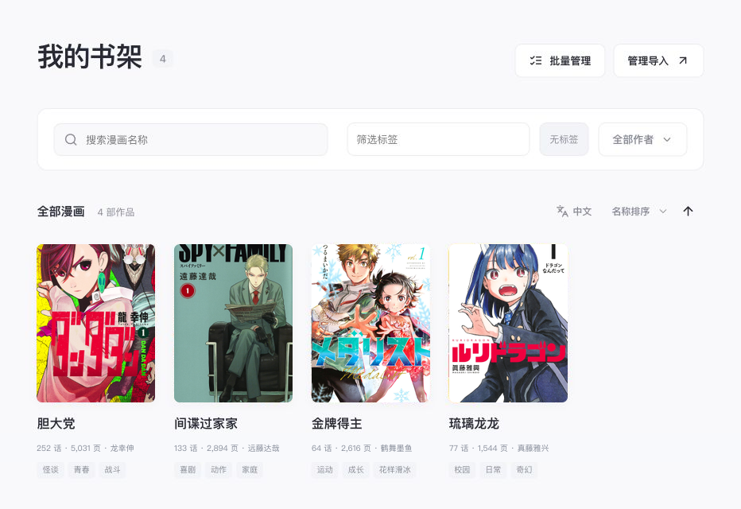
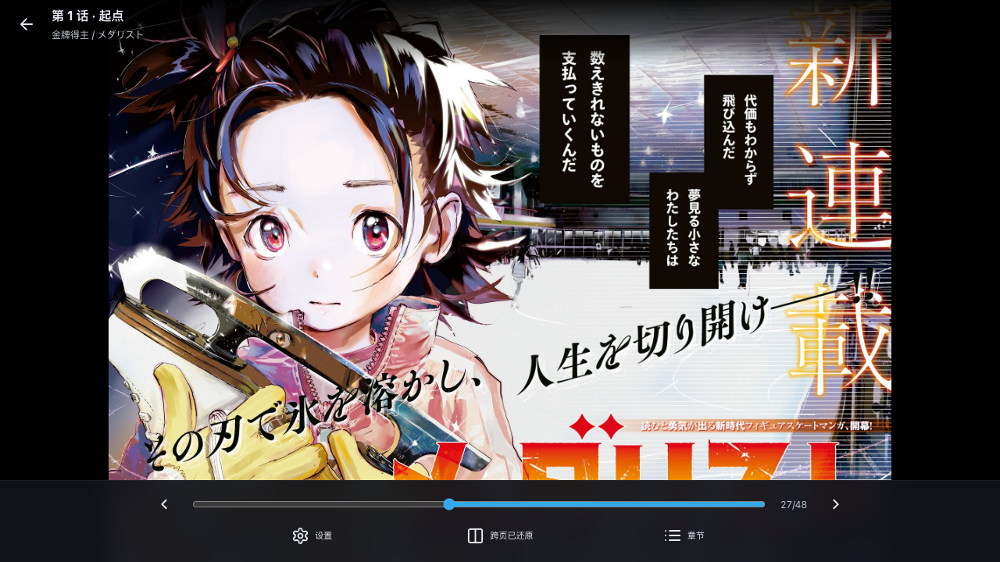

<picture>
  <source media="(prefers-color-scheme: dark)" srcset="docs/images/logo-dark.png">
  
</picture>

<p align="center">
  <a href="https://github.com/TonyCrane/manga-reader/actions/workflows/publish-image.yml">
    
  </a>
  <a href="LICENSE">
    
  </a>
</p>

一个面向 NAS 的自托管纯净漫画阅读器。支持漫画导入管理、阅读优化、跨页拆分与双页合并阅读、哔哩哔哩漫画同款阅读手势与 PWA 应用。





> 演示素材仅用于功能展示，作品版权归原作者及出版社所有。

## 特性

### 跨页拆分与图片优化

- 跨页横图自动从中间拆成两页（或四联跨页也可以拆成四页），可在阅读器横屏模式下拼接跨页；
- 拆分页按日漫习惯从右向左排列，不裁切像素，也不修改原始文件；
- 导入的图片会生成优化图和预览图并进行预加载，加速阅读中的加载速度；
- 未拆页的原图直接从只读素材目录鉴权读取，只有跨页拆分结果会额外保存无损原图。

### 阅读器

阅读体验仿照哔哩哔哩漫画进行优化：

- 支持单页、双页、纵向滚动三种阅读方式；
- 横屏双页采用从右向左的日漫顺序，并可直接翻到相邻章节，阅读体验更顺畅；
- 双页下双指单击可以切换跨页的拼接顺序；
- 支持点击两侧翻页、滑动翻页和双指缩放。

### iOS PWA

支持 PWA，在 iPhone 或 iPad 的 Safari 中选择“分享 → 添加到主屏幕”，即可从主屏幕以独立窗口打开，体验与原生 APP 相同，无需额外安装 APP。

\*仅在 iOS 上测试过 PWA 功能，尚未测试其他平台。

## 部署

需要 Docker Engine 和 Docker Compose v2。项目镜像发布在 `ghcr.io/tonycrane/manga-reader`，支持 `linux/amd64` 和 `linux/arm64`。

下载 [`compose.yml`](compose.yml)：

```sh
mkdir manga-reader && cd manga-reader
curl -LO https://raw.githubusercontent.com/TonyCrane/manga-reader/master/compose.yml
```

打开 `compose.yml`，修改端口、原始漫画目录和 Cookie 设置。默认使用 `latest` 镜像：

```yaml
image: ghcr.io/tonycrane/manga-reader:latest
ports:
  - "3000:3000"
environment:
  COOKIE_SECURE: "false"
volumes:
  - /path/to/manga:/manga:ro
  - ./.data:/data
  - ./.processed:/processed
```

三个容器目录各有独立用途：

- `/manga`：原始漫画，只读挂载；
- `/data`：SQLite 数据库；
- `/processed`：优化图、预览图、拆分页无损图和上传封面。

三个目录不能互相包含或重叠。`/data` 和 `/processed` 需要允许容器内的 UID/GID `1000:1000` 写入。

```sh
mkdir -p .data .processed
sudo chown -R 1000:1000 .data .processed
docker compose up -d
```

服务启动后访问 `http://服务器地址:3000`。可以通过以下命令确认容器状态：

```sh
docker compose ps
docker compose logs --tail=50
```

通过 HTTPS 访问时，将 `COOKIE_SECURE` 改为 `"true"`。反向代理需要保留 `Host` 请求头，并允许最多 20 MiB 的封面上传。

`latest` 会随 `master` 分支更新。每次发布也会生成对应的 7 位提交 SHA 标签；需要固定版本时，可以在 `compose.yml` 中将 `latest` 换成该标签。

## 漫画目录

常见目录结构如下：

```text
manga/
├── 漫画标题1/
│   ├── #001 第一话/
│   │   ├── 01.png
│   │   └── 02.jpg
│   └── #002 第二话/
│       ├── 01.jpg
│       └── 02.webp
└── 漫画标题2/
    ├── 01.png
    └── ...
```

一部漫画只有图片而没有子目录时，所有图片会作为同一话导入；存在子目录时，每个含图片的子目录视为一话。漫画和章节按目录名称的字典序排列，章节内图片使用自然排序，例如 `1.jpg、2.jpg、10.jpg`。

添加导入源时可以选择：

- **完全手动**：所选目录本身是一部漫画；
- **一层扫描**：所选目录下的每个子目录是一部漫画；
- **二层扫描**：第一层目录是作者名，第二层目录是漫画。

扫描不会修改或删除原始漫画。目录改名会被视为新内容，刷新也不会自动删除旧的漫画或章节记录。

## 使用方法

### 1. 创建账号

首次打开服务时，按页面提示注册第一个管理员账号。管理员可以在“设置 → 系统管理”中创建普通用户；使用初始密码登录的用户必须先修改密码，之后才能进入书架。

系统始终保留至少一名管理员。普通用户只能访问已授权的漫画，不能管理其他账号、导入源或漫画信息。

### 2. 导入漫画

1. 以管理员身份进入“设置 → 系统管理”；
2. 添加导入源，填写 `/manga` 下的目录并选择扫描方式；
3. 选择可以访问这个来源的用户；
4. 保存后运行刷新任务，等待导入完成。

一部漫画可以关联多个导入源。用户获得任一来源的权限后即可访问，平台仍会在列表、详情、封面和阅读图片接口上校验权限。

### 3. 编辑漫画信息

在漫画详情页打开编辑面板，可以修改日文标题、中文标题、作者、日期、标签、封面和章节标题。手动填写的内容不会在刷新导入源时被覆盖。

跨页拆分也可以在这里按漫画开关。保存更改后，平台会在后台重新扫描并生成对应页面。

### 4. 使用 DeepSeek 翻译标题

1. 进入“设置 → DeepSeek 翻译设置”；
2. 填写 API Key、模型和翻译提示词并保存，默认模型为 `deepseek-flash`；
3. 打开漫画编辑面板，点击“DeepSeek 翻译”；
4. 检查填入的中文标题，保存漫画信息后生效。

翻译配置按当前管理员账号保存在服务器，可在登录后的其他设备上继续使用。翻译请求由浏览器直接发送到 DeepSeek，服务器不代理请求；使用费用由对应的 DeepSeek API 账号承担。

### 5. 刷新导入库

- **仅刷新新增**：发现新漫画和新章节，已有章节会被跳过，适合日常追更后快速刷新；
- **刷新全部**：检查已有章节的文件变化，修复缺失的处理文件，并复用没有变化的图片。

同一时间只会运行一个导入任务。刷新期间可以离开设置页，任务完成后回到书架查看结果。

系统管理页会显示处理目录的使用中与可清理空间。空间清理只删除当前章节、封面和预览不再引用的派生文件，不会修改只读挂载中的原始漫画。

### 6. 阅读

打开漫画并选择章节即可进入阅读器。分页模式下，画面左侧进入下一页、右侧返回上一页，中间区域打开菜单；也可以左右滑动。横屏时可在菜单中选择单页或双页，每部漫画会分别记住这个偏好。

双指缩放后，单指手势用于移动图片而不是翻页。纵向滚动模式会连续显示章节，并在接近页面时再加载图片。

## 本地开发

需要 Node.js 22 和 npm：

```sh
npm ci
npm run dev
```

开发模式下，前端默认运行在 `5173` 端口，后端运行在 `3000` 端口。提交前可以运行：

```sh
npm run build
npm run format:check
docker compose config --quiet
```

## 许可证

本项目以 [GNU Affero General Public License v3.0](LICENSE) 发布。

## AI 声明

本项目的编写和维护全部由 AI 完成，具体模型在 commit msg 中有标注，如有介意请勿使用。
